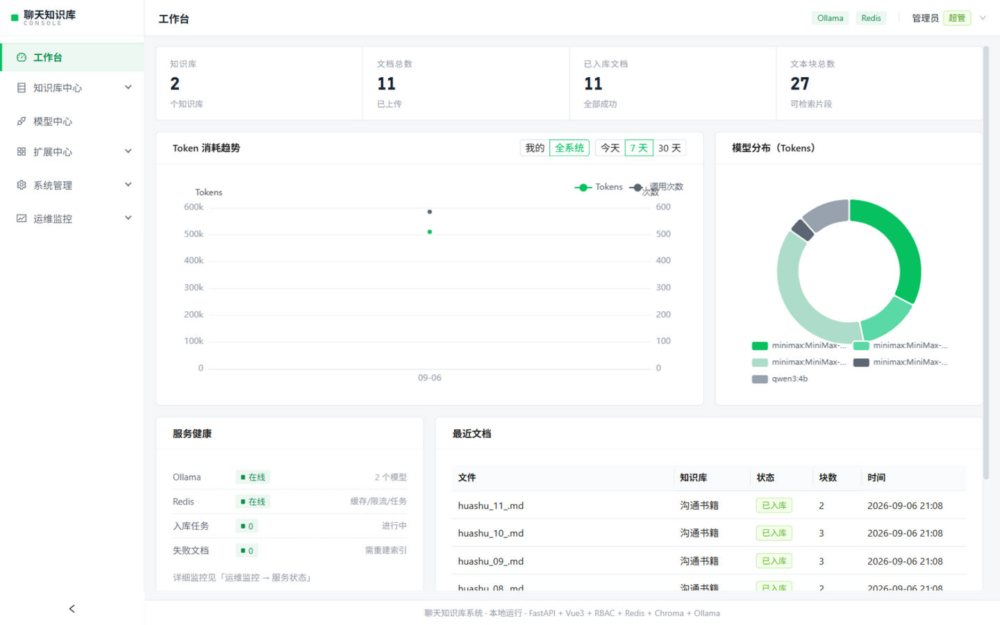
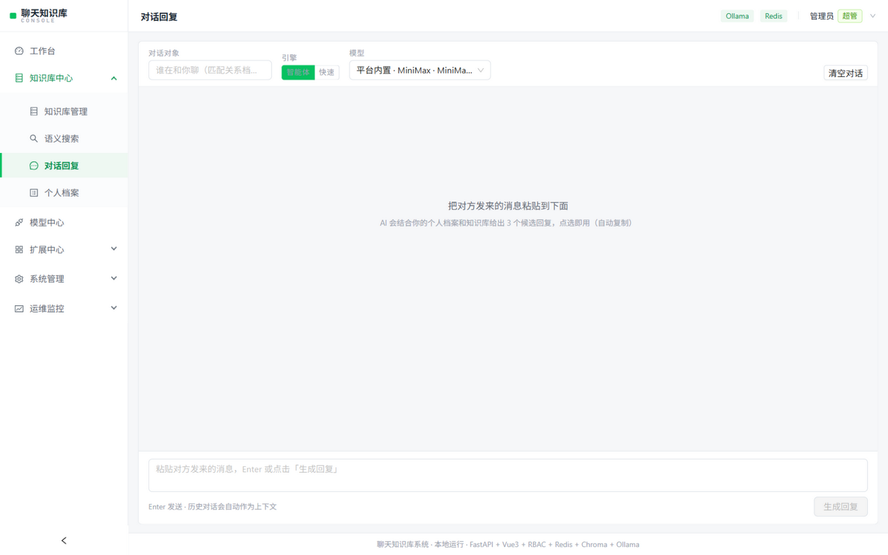
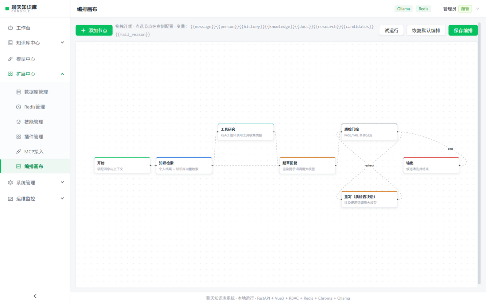

# 聊天知识库系统 · ChatKB Console

[English](./README_EN.md) | 简体中文

本地优先的「微信高情商回复」智能体系统：书籍语料 + 个人档案全向量化，检索与生成可全走本机，也可接入国内任意云端大模型；工作流编排 + 技能/插件/MCP 扩展 + 完整 RBAC 后台。



## ✨ 功能特性

| 模块 | 能力 |
|---|---|
| 💬 对话回复 | 微信式对话界面；智能体多步执行（检索→工具研究→起草→质检门控），**思维链路实时流式展示**；候选点选即复制 |
| 📚 知识库 | 多知识库、拖拽上传 PDF/EPUB/DOCX/TXT/MD/HTML，分块→bge-m3 嵌入→Chroma；WebSocket 实时入库进度 |
| 🔍 语义搜索 | 跨库检索、相关度、出处（章节/页码）、关键词高亮（Redis 缓存） |
| 🤖 模型中心 | 14+ 国内厂商 OpenAI 兼容统一接入（DeepSeek/Kimi/智谱/通义/豆包/千帆/星火/混元/硅基流动/MiniMax/阶跃/零一/OpenAI/自定义），选厂商+填密钥两步接入；模型拉取、连接测试、Token 用量统计（趋势图/模型分布环图） |
| 🧩 扩展中心 | SQLite 可视化（表浏览+只读 SQL 控制台）、Redis 可视化（键扫描/值查看/TTL）、技能管理（JSON 热加载）、HTTP 工具插件、MCP 接入（stdio/SSE） |
| 🎨 编排画布 | Dify 风格工作流编辑器：6 类节点、拖拽连线、节点级配置（提示词模板 `{{变量}}`）、条件分支、试运行；**画布定义真实驱动执行引擎** |
| 👥 系统管理 | RBAC 权限（用户-角色-菜单/按钮权限码）、开放注册、操作审计日志 |
| 📈 运维监控 | Ollama/Redis/SQLite/Chroma 健康与容量、任务中心、审计流水 |




## 🏗️ 技术栈

- **前端**：Vue 3 · Vite · Ant Design Vue · Pinia · Vue Router · Axios · ECharts · Vue Flow · Less
- **后端**：FastAPI · SQLAlchemy 2.0 (SQLite/WAL) · Pydantic v2 · JWT(PyJWT+PBKDF2) · Redis（嵌入缓存/限流/任务状态/Pub-Sub，不可用自动降级 fakeredis）· WebSocket · APScheduler · Chroma · Ollama · LangChain/LangGraph 协议栈
- **智能体**：工作流解释执行器（agent/flow.py）、内置工具 4 个、技能热加载、HTTP 插件、MCP 客户端、NDJSON 流式输出
- **测试**：pytest 19 用例（Fake 模型，不依赖真实服务）

## 🚀 快速开始

```bash
# 1. 依赖
pip install -r requirements.txt
cd frontend && npm install && npm run build && cd ..

# 2. 模型（本地）
ollama pull bge-m3
ollama pull qwen3:4b

# 3. 启动 → http://127.0.0.1:8000
python backend/main.py        # 或双击 启动系统.bat
```

默认账号 `admin / admin123`（登录后请立即修改）。云端模型：登录 → 模型中心 → 添加服务商 → 选厂商 + 填 API Key。

### 使用平台内置模型（可选）

不配置任何 Key 也可用本地 Ollama。如需预置云端模型，设置环境变量或写入文件后重启：

```bash
export CHATKB_MINIMAX_KEY=sk-xxx     # 或 backend/data/minimax_key.txt
```

## 🤖 智能体工作流

```
开始 ─▶ 知识检索 ─▶ 工具研究(ReAct) ─▶ LLM起草 ─▶ 质检门控 ─▶ 输出
                                        ▲ FAIL 带原因重写 │
                                        └────────────────┘
```

- 画布上可增删节点、连线、编辑每个 LLM 节点的提示词模板（`{{message}}` `{{knowledge}}` 等变量），保存即生效
- 技能 = 关键词匹配 + 场景纪律，`backend/app/agent/skills/*.json` 丢文件即扩展
- 插件 = HTTP 端点 JSON 定义；MCP 标准协议 server 配置即接入

## 📖 示例语料

`knowledge/` 内置 11 本原创「说话艺术」手册（职场/社交/赞美批评/拒绝/道歉/谈钱/破冰/群聊/亲密关系/暧昧拉扯·男女篇），可自行替换为你的正版书籍。

## ⚠️ 合规说明

- 请勿上传盗版电子书；仅导入你拥有合法使用权的语料
- API Key 加密存于本机 `backend/data/`，该目录已被 .gitignore 排除
- 默认密码请第一时间修改；对外暴露端口前请加反向代理与 HTTPS

## 📄 许可

仅供学习研究。`knowledge/` 下语料为项目原创，可自由使用。
